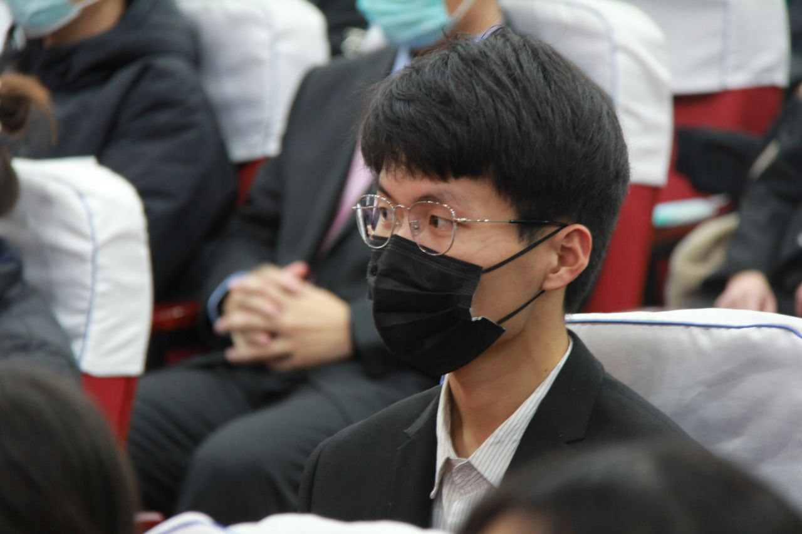

    

唯一一张人模狗样的照片

由学工在线摄影部拍摄于2020年学工在线成立大会

*** 

wolfyzhang 对许巍音乐的喜爱分三个阶段，他一直在听的歌手也只有许巍。

第一个阶段，他喜欢许巍的节奏，对歌词不感冒，只是在哼节奏，好听。

第二个阶段，他喜欢许巍的歌词，得过抑郁症的许巍写的歌词很符合他当时的心境。

第三个阶段，他喜欢许巍的感觉，节奏也好，歌词也好，都是文艺的摇滚乐。他喜欢那种内心澎湃的同时表面还波澜不惊的感觉。

他觉得，人的内心应该是自由的，他喜欢不受约束，所以他 GPA 不高。

他喜欢深夜边听许巍边写代码、写文章，享受夜的温柔，他喜欢 Linux 和 Vim。

微信张小龙有个说法，说每个人都是环境反应的容器，同时拥有自作用。wolfyzhang 很喜欢。

每个人都有自身的特质，也身处不同环境之中，二者互相影响，促成每个人都拥有的不同的想法。这些想法由环境刺激产生。

他以为，这些不讲求时机冒出来的天马行空的想法，或许是很有价值的一些东西。

他高中学校强迫每个学生每天写 500 字的随笔，他照做了，三年下来写了 30 多万字，所以现在他经常写病句。

他不仅写病句，他还把这些病句写成了微博，发饭否，发推特，发频道，发个人网站。内容全是他的不切实际的幻想和听来的乱七八糟的异次元故事。

他也不怕恶心到别人，因为他知道只有他几个朋友偶尔会上去看看。他的朋友……呃好吧，应该还凑不齐一桌火锅。

他经常觉得他很孤独，直到那个姑娘主动接近他，他很惊奇。当然，可能因为彼此的幼稚，现在他又孤独了，他告诉自己，新的人生阶段已经展开，不要再去打扰她。这之后，他也就更喜欢听许巍，喜欢深夜边听许巍边写代码、写文章，白天睡觉。

wolfyzhang 一看到人多，就害怕，如果很多人都盯着他，他就六神无主，不知所措，他特别喜欢在角落里盯着人群看人群里的每个人。

“诶，那个人刚才说‘xx 好着没有’？那他可能是西北人，或者和西北人认识。这边这个人说话偶尔有上扬音，他大概是江苏人吧，或者和江苏人打过比较深入的交道什么的。”

“这边这人在写一个什么东西，看 UI 和代码结构像是前端布局，但是他看起来遇到了一点困难，反复切换窗口看样式效果，我要不要主动去帮他看看……”，他是那种木讷到在课堂上如果老师提问没人举手，即便他知道答案他也不会再举手的人。

因为这个特点，他错过了很多东西，但是还没什么办法，就只能在朋友面前说很多话，或者自己写写写。

他喜欢福尔摩斯，而且觉得超意兴透明碗筷橱设计能和 Apple 的交互设计比肩。小细节上见体验设计的真章。

wolfyzhang 本科学的电信专业，他了解了一些嵌入式、FPGA 和信息论等偏向于硬件、通信的知识。这侧面帮助了他了解计算机系统。

初中，他第一次接触计算机和互联网，那个时候很多东西还不像现在这样，所以他很喜欢开源。

他很奇怪，他自己住酒店的时候，只要是一片寂静他就会心烦意乱，他每次都放郭德纲相声作白噪音。一个有人说话的角落，让他心安。

一个这么腼腆的人，想把自己对陌生人隐藏在沉默背后的人，居然还这么害怕独处，但和朋友一起就话多得不行。他觉得自己就是个笑话。

wolfyzhang 还有几个月就要毕业了，同时还对发着 39 度高烧考完的 2023 年研究生入学考试的结果不报什么特别的期望，所以他现在只想先埋头完成自己的毕业设计，那是一个他从大二就有的 idea。

毕业设计做完之后，他大概会先去找个和学术界关系比较密切的地方去实习，节省一些，暂时能养活自己，有个地方落脚就好。之后的事情，就看变化的条件造就了什么样的情况再决定吧。

总之，还是要再好好学习一段时间，之后再去找个老老实实搬砖的活。

如果你读到了这里，还不讨厌 wolfyzhang，那或许你可以试试用下面的联系方式和他联系一下。

祝你们交流愉快。

> Email: wolfyzhang(at)outlook(dot)com
> Resume: [https://wolfyzhang.com](https://wolfyzhang.com)
> telegram: [@wolfyzhang](https://t.me/wolfyzhang)
> fanfou: [@wolfyzhang](https://fanfou.com/wolfyzhang)
> GitHub：[@wolfyzhang-github](https://github.com/wolfyzhang-github)
> twitter: [@wolfyzhang](https://twitter.com/wolfyzhang)